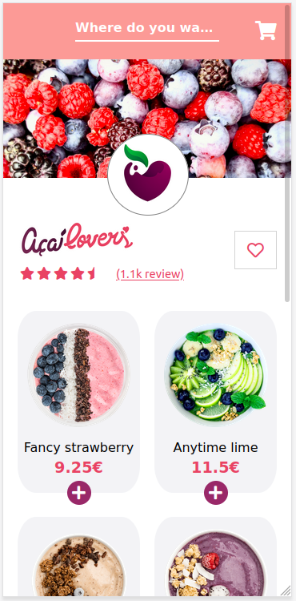
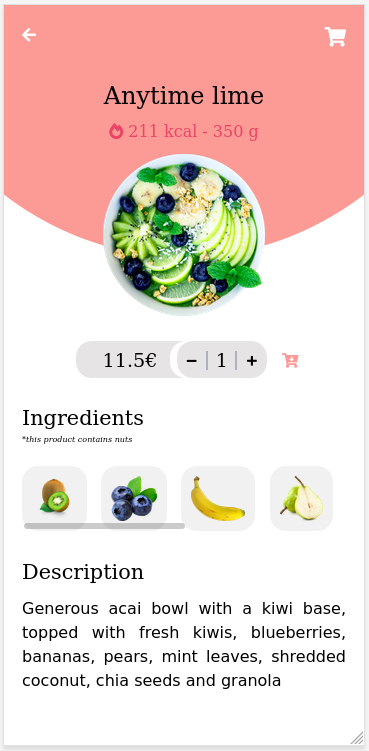
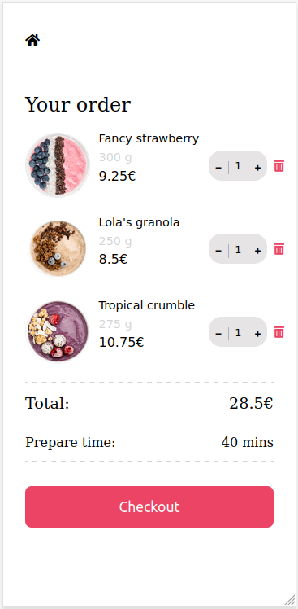

# Takeout app

[Deployed site](https://60e47cde3b49e1758546c451--acai-lovers-restaurant.netlify.app/cart)

This was a solo project carried out from the 29th of June to the 6th of July. I wanted to challenge myself and see if I could create a small takeout app using React and Typescript.
I chose those designs created by [Dmitry Lauretsky](https://dribbble.com/shots/15282794/attachments/7036232?mode=media) and [Anastasia](https://dribbble.com/shots/14369818-Food-Delivery-service-Mobile-App/attachments/6038591?mode=media) on Dribbble as my main inspiration, adding my personal touch. I also used the logo design of [multiple owners](https://www.behance.net/gallery/32938043/Acai-Lovers-Branding-Logo-Design) on Behance.

**PLEASE NOTE:** 
I only did the mobile design
* * * 

## Technologies: 
- React (with hooks, useState & useEffect) bootstrapped with create-react-app
- Typescript
- React-router-dom

## Pages:

## [Deployed site!](https://60e47cde3b49e1758546c451--acai-lovers-restaurant.netlify.app/cart)

